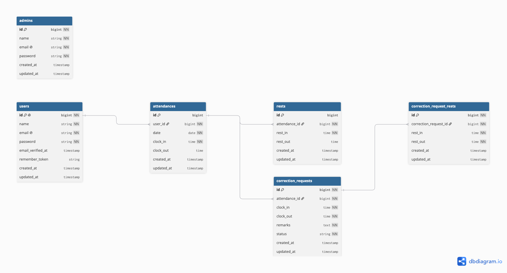

# アプリ名
白もふ販売専門店
## 概要
犬のペットショップで働くスタッフのための勤怠管理アプリです。スタッフは出勤・退勤・休憩を記録でき、管理者はスタッフの勤怠の確認や、修正申請の承認ができます。
## 使用技術
使用技術

PHP：プログラミング言語
Laravel：PHP でWebアプリを作るためのフレームワーク
MySQL：データベース（今日設計したテーブルを入れる場所）
Docker：開発環境を作るための道具
Fortify：ログイン・会員登録
FormRequest：バリデーション
（応用）MailHog または Mailtrap：メール認証のテスト
## 環境構築
環境構築後に追記予定
## ER図
